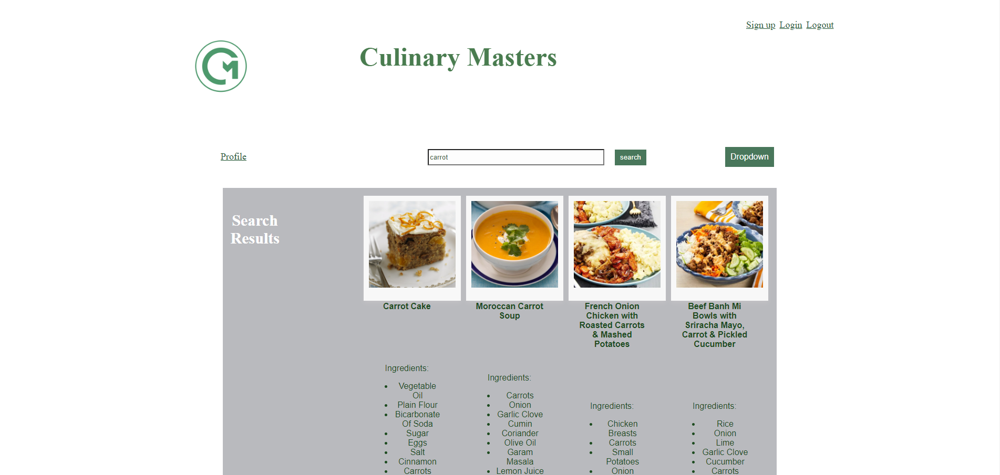

# Culinary Masters

## Description
    this web app lets user find new recipes and lets the user create a new recipe.
## Installation
    To install make sure to run npm i to install all the dependacies.
## Instructions
    When you run the server you will be brought to the landing page, create and account or login. You will be taken to the profile where you can publish a recipe
    or search recipes on the homepage. 
## Usage
    used to find new recipes.
## Screenshot
    
## Test
    N/A
## Credits
    N/A
## License

## How to Contribute
    N/A
## Features
    Add, edit and delete recipes. Search recipes
## Questions
https://github.com/manjotpadda13/CulinaryMasters
n/a